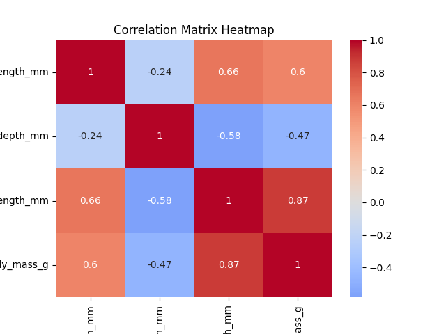
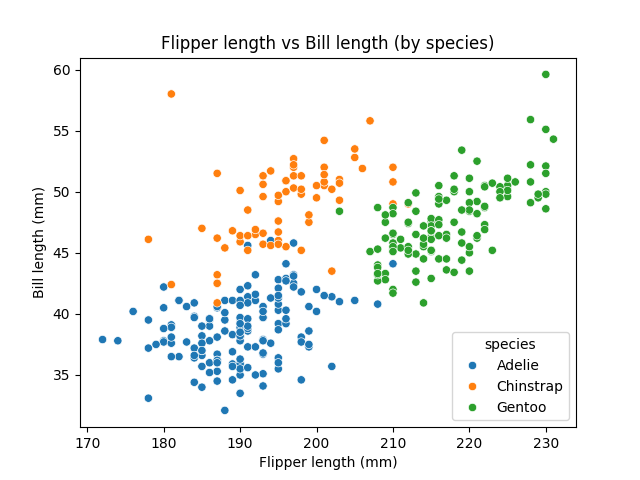
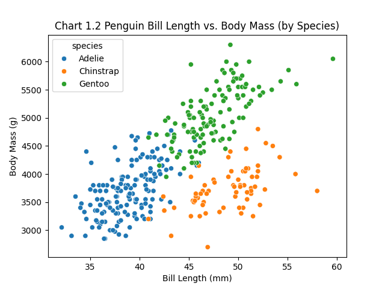
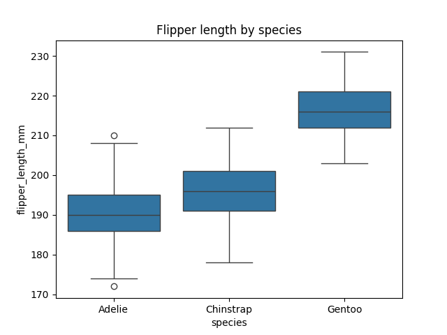
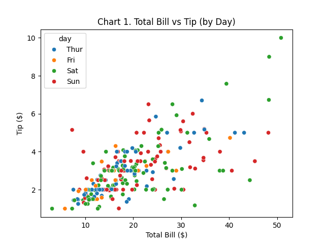
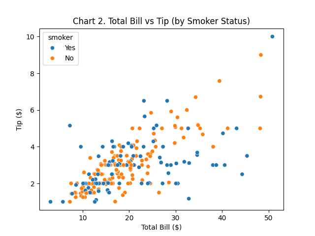
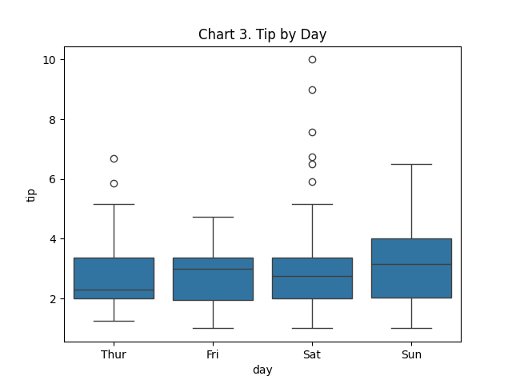

# datafun-04-notebooks

[](https://denisecase.github.io/pro-analytics-02/workflow-b-apply-example-project/)
[](./pyproject.toml)
[](./LICENSE)

> Professional Python project: exploratory data analysis with Jupyter notebooks.

Data analytics requires a variety of skills.
This course builds capabilities through working projects.

In the age of generative AI, durable skills are grounded in real work:
setting up a professional environment,
reading and running code,
understanding the logic,
and pushing work to a shared repository.
Each project follows the structure of professional Python projects.
We learn by doing.

## This Project

This project introduces **Exploratory Data Analysis (EDA)** using Jupyter notebooks.

When we encounter a new dataset, we want to explore quickly:
run checks, view distributions, identify missing values or outliers.
Notebooks combine Markdown narrative with Python code cells and are ideal for this kind of investigation.

You will run the example notebook, read the code and narrative,
and create your own notebook to explore a different tabular dataset.

## Working Files

You'll work with just these areas:

- **docs/** - the project narrative and documentation
- **src/datafun** - supporting Python module
- **notebooks/** - where the analysis happens
- **pyproject.toml** - update authorship & links
- **zensical.toml** - update authorship & links

## Instructions (pro-analytics-02)

Follow the
[step-by-step workflow guide](https://denisecase.github.io/pro-analytics-02/workflow-b-apply-example-project/)
to complete:

1. Phase 1. **Start & Run**
2. Phase 2. **Change Authorship**
3. Phase 3. **Read & Understand**
4. Phase 4. **Modify**
5. Phase 5. **Apply**

## Challenges

Challenges are expected.
Sometimes instructions may not quite match your operating system.
When issues occur, share screenshots, error messages, and details about what you tried.
Working through issues is part of implementing professional projects.

## Success

After completing Phase 1. **Start & Run**, you'll have your own GitHub project,
with the example notebook executed and committed,
and running the example script will print out:

```shell
========================
Executed successfully!
========================
```

A new file `project.log` will appear in the root project folder.

## Command Reference

The commands below are used in the workflow guide above.
They are provided here for convenience.

Follow the guide for the **full instructions**.

<details>
<summary>Show command reference</summary>

### In a machine terminal (open in your `Repos` folder)

After you get a copy of this repo in your own GitHub account,
open a machine terminal in your `Repos` folder:

```shell
# Replace username with YOUR GitHub username.
git clone https://github.com/sum-randow/datafun-04-notebooks

cd datafun-04-notebooks
code .
```

### In a VS Code terminal

These are listed for convenience.
For best results, follow the detailed instructions in
[pro-analytics-02 guide](https://denisecase.github.io/pro-analytics-02/)
to complete:

```shell
uv self update
uv python pin 3.14
uv sync --extra dev --extra docs --upgrade

uvx pre-commit install

git add -A
uvx pre-commit run --all-files
# repeat if changes were made
uvx pre-commit run --all-files

# run the module to verify the environment (.venv)
uv run python -m datafun.app_sum-randow

# do chores
uv run ruff format .
uv run ruff check . --fix
uv run python -m pyright
uv run python -m pytest
uv run python -m zensical build

# save progress
git add -A
git commit -m "update"
git push -u origin main
```

</details>

## Notes

- Use the **UP ARROW** and **DOWN ARROW** in the terminal to scroll through past commands.
- Use `CTRL+f` to find (and replace) text within a file.
- You do not need to add to or modify `tests/`. They are provided for example only.
- Many files are silent helpers. Explore as you like, but nothing is required.
- You do NOT not to understand everything; understanding builds naturally over time.

## Troubleshooting >>>

If you see something like this in your terminal: `>>>` or `...`
You accidentally started Python interactive mode.
It happens.
Press `Ctrl+c` (both keys together) or `Ctrl+Z` then `Enter` on Windows.

```
```
## Findings and Visuals

Example Graphs









```
```
## Custom Project

### Dataset
- Dataset: Tips
- Description: Restaurant tipping data recording total bill, tip amount, and inforamtion about the dining party (size, time, day, smoker status).
- Source: Bryant, P. G. and Smith, M. A. (1995), Practical Data Analysis:
      Case Studies in Business Statistics.
    - Access: Available via Seaborn's built-in datasets

### Phase 4 Modifications
-In Phase 4 I created a second scatterplot to compare two new variables: bill length vs body mass.
-We knew for the heat map that there was not as strong a correlation between these two variables, which is visible now in the new scatterplot.

### Phase 5 Custom Project
-In Phase 5 I created a new notebook and .py code to run an EDA on the Tips data set (described above)
- Overall, it is noted that Total Bill is a relatively good indicator of Tip.  Thus, a next step could be to do a linear regression of the data in order to model tip based on a total bill.  It was noted that weekends appear to have significant variability as to what tip to expect.

## Findings and Visuals






